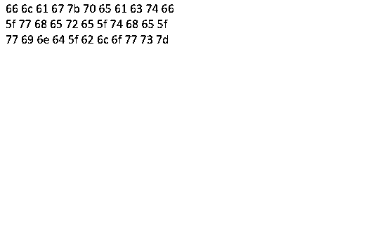

# The Wonderful Wizard

* Category: Forensics

## Description

[TheWonderfulWizard.png](TheWonderfulWizard.png)

## Solution

The original image is:


Let's fire up StegSolve and open the image.

Browsing the various visualization we easily find a hidden text:



```
66 6c 61 67 7b 70 65 61 63 74 66
5f 77 68 65 72 65 5f 74 68 65 5f
77 69 6e 64 5f 62 6c 6f 77 73 7d
```

This seems to be ASCII codes in hex, let's find out by using a [hex2ascii converter](https://www.rapidtables.com/convert/number/hex-to-ascii.html): 

**flag{peactf_where_the_wind_blows}**
